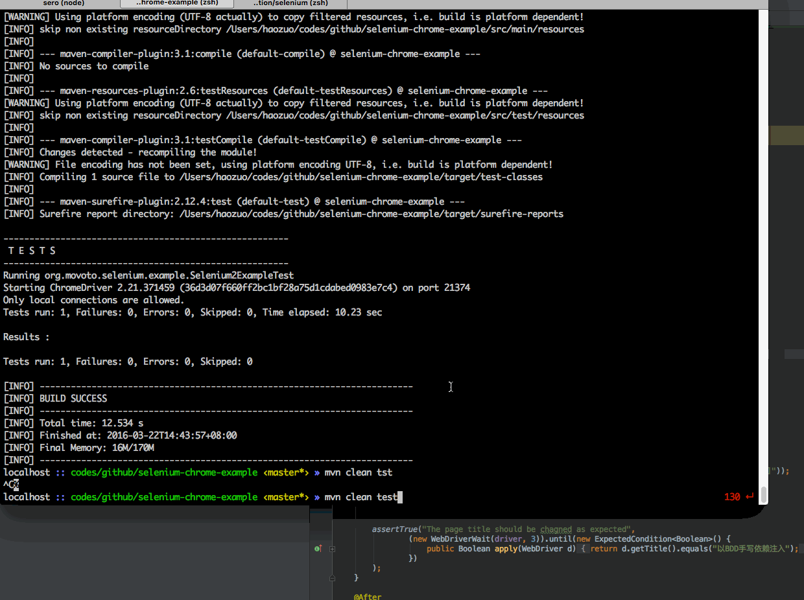

# Selenium Frontend
Projecto que utiliza Selenium para correr pruebas automatizadas en el frontend utilizando el WebDriver de Safari.

## Prerequisitos ##

* Instalar [java8](http://www.oracle.com/technetwork/java/javase/downloads/index.html) installed

## Configuración ##

El WebDriver de Safari requiere una máquina corriendo macOS que tenga instalado Safari.

1. Descargar repositorio
2. Abrir con IntelliJ y descargar dependencias de Maven (IntelliJ lo hace automáticamente)
3. Correr pruebas

## Ejecutar pruebas automatizadas ##

```bash
mvn clean test
```

El resultado es el siguiente:


